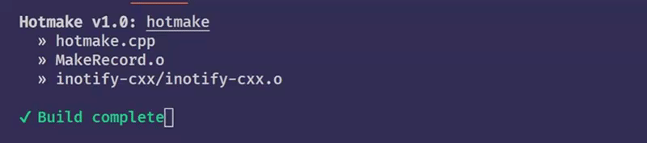
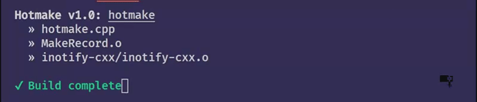

# hotmake-cpp

Hotmake is a build utility for C++ developers with a need for real-time compilation and error feedback.

|               Saving with no errors               |        Saving with compiler errors         |
| :-----------------------------------------------: | :----------------------------------------: |
|  |  |

## Overview

Hotmake runs in the terminal as an interactive executable. When run, it analyzes any valid makefile in the current execution directory to find the target rule and determine its dependencies. Once the dependencies are determined, hotmake watches those dependencies for changes, and then re-builds the target as needed. Any errors are logged to the terminal with the file name, line number, error type and details.

## Project Status (WIP)

This project is currently a work-in-progress and should not be expected to work as-is for most use-cases. Please use this tool only for experimentation and not for production.

#### Hotmake has only been tested and built against `Clang++4.0`, and functionality may vary between compilers.
### Hotmake is aimed for use on UNIX-based systems only. This tool will not work on Windows-based systems in its current state (use WSL if needed).

The current development timeline is as follows:

- [ ] Add tests for basic functionality verification.
- [ ] Support for Continuous Integration Testing with TravisCI
- [ ] MakeRecord should consider implicit make rules by looking at source files.
- [ ] Refactor command-line-interface printing by extracting logic from main.
- [ ] Add support for GCC
